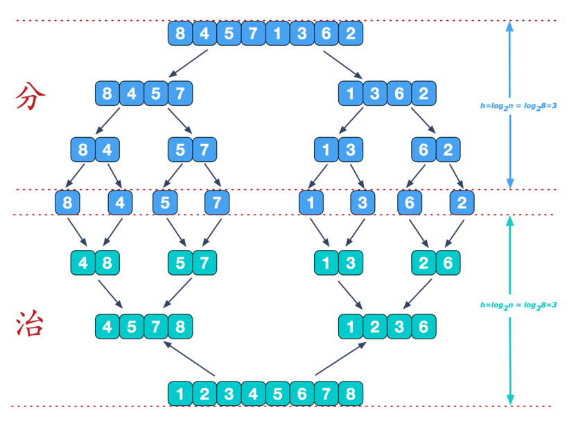

# JavaBasis
尚硅谷Java DataStructure And Algorithm Tutorial
# DataStructures

1. 数组
2. 利用java的obj类创建于List的功能和效果
3. 链表的数据操作 顺序 添加 腾讯 百度面试题
4. 使用栈stack数据结构，设计一个简单的计算机  

# Algorithm

#### 1.递归算法

- 解决迷宫问题
- 解决八皇后问题

#### 2.排序算法

1.  ##### 简介

     1.  (Sort Algorithm)，排序是将一组数据，依指定的顺序进行排列的过程。

 2.  ##### 内部排序
3. ##### 插入排序
   
   -  直接插入排序 
      1.  
      2.  希尔排序
   -  选择排序
   -  简单选择排序
     1. 
   -  堆排序
4.  ##### 交换排序
   
   - 冒泡排序  
     1.  通过对待排序序列从前向后（从下标较小的元素开始）,依次比较相邻元素的值，若发现逆序则交换，使值较大的元素逐渐从前移向后部。
     2. 因为排序的过程中，各元素不断接近自己的位置，如果一趟比较下来没有进行过交换，就说明序列有序，因此要在排序过程中设置一个标志flag判断元素是否进行过交换。而减少不必要的比较。(这里说的优化，可以在冒泡排序写好后，在进行)
     3.  
   - 快速排序
5. ##### 归并排序

5. ##### 基数排序

3. ##### 外部排序

1.    ##### 使用内存和外存结合 

8. ##### （数据量过大，无法全部加载到内存中，需要借助外部存储进行排序）

9. ##### 总结 

   -  上述算法时间空间复杂度

   - 

   -  相关术语解释： 

   - 稳定：

     > 如果 a 原本在 b 前面，而 a=b，排序之后 a 仍然在 b 的前面；
     >
     > 2) 不稳定：如果 a 原本在 b 的前面，而 a=b，排序之后 a 可能会出现在 b 的后面；
     >
     > 3) 内排序：所有排序操作都在内存中完成；
     >
     > 4) 外排序：由于数据太大，因此把数据放在磁盘中，而排序通过磁盘和内存的数据传输才能进行；
     >
     > 5) 时间复杂度： 一个算法执行所耗费的时间。
     >
     > 6) 空间复杂度：运行完一个程序所需内存的大小。
     >
     > 7) n: 数据规模
     >
     > 8) k: “桶”的个数
     >
     > 9) In-place: 不占用额外内存
     >
     > 10) Out-place: 占用额外内存

#### 3.查找算法

- #####  顺序(线性)查找

- ##### 二分查找/折半查找 

- #####  插值查找 

- #####  斐波那契查找

# Complexity of the algorithm

## Time Complexity

- 事后统计的方法这种方法可行, 但是有两个问题：一是要想对设计的算法的运行性能进行评测，需要实际运行该程序；二是所得时间的统计量依赖于计算机的硬件、软件等环境因素, 这种方式，要在同一台计算机的相同状态下运行，才能比较那个算法速度更快。
- 事前估算的方法通过分析某个算法的时间复杂度来判断哪个算法更优.

## Place Complexity

  

